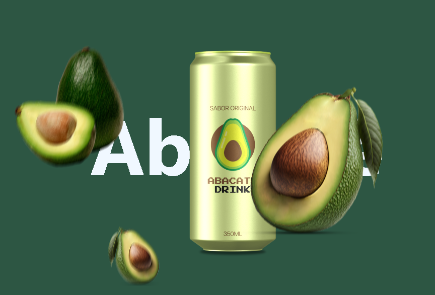

# Fruit Beverage Selector

This project is a simple webpage built with HTML, CSS, and JavaScript that features a selection of different fruit beverages. The user can navigate through different fruit flavors using the provided buttons, which dynamically update the displayed fruit and beverage images.



## Features:
- **Responsive Design**: The layout is fully responsive, adapting to different screen sizes.
- **JavaScript Interactivity**: The navigation between fruit options is handled using vanilla JavaScript, allowing users to move forward and backward through the selections.
- **Custom Styling**: Each fruit and its corresponding beverage are visually represented with custom images and background colors.

## Technologies Used:
- **HTML**: Markup for the structure of the page.
- **CSS**: Custom styles for layout and visual design.
- **JavaScript**: Logic for interactivity and dynamic content updates.

## How to Run the Project
1. Clone this repository:
    ```bash
    git clone https://github.com/your-username/your-repo-name.git
    ```
2. Open the `index.html` file in your browser to view the webpage.
